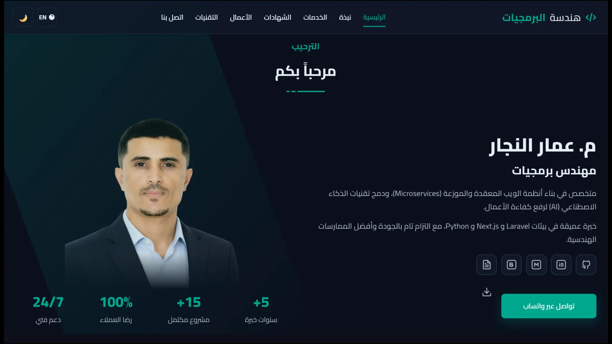
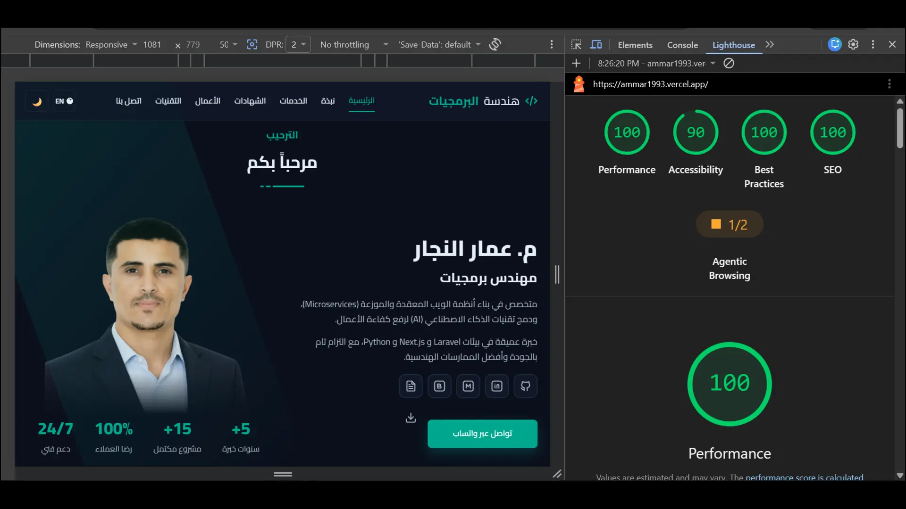
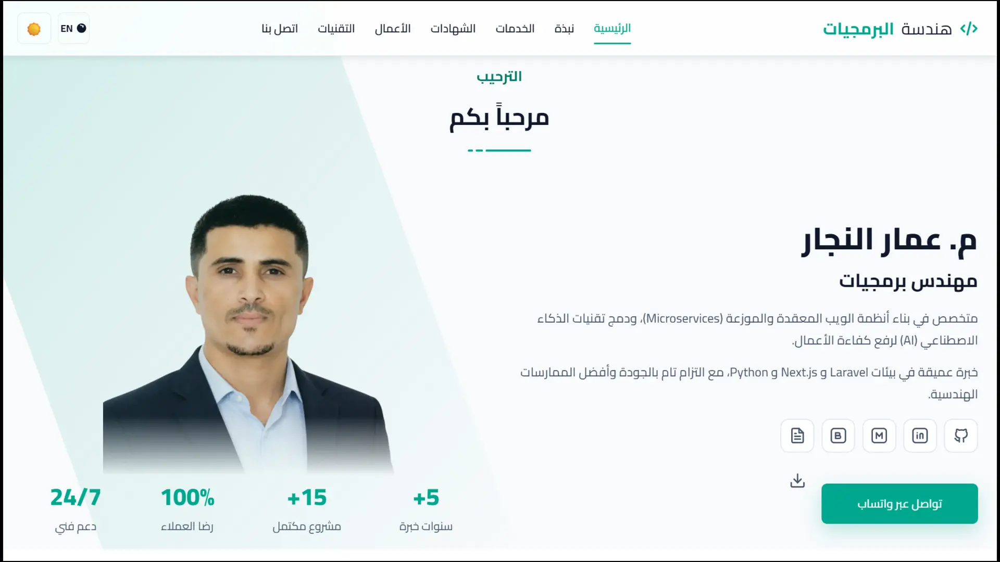
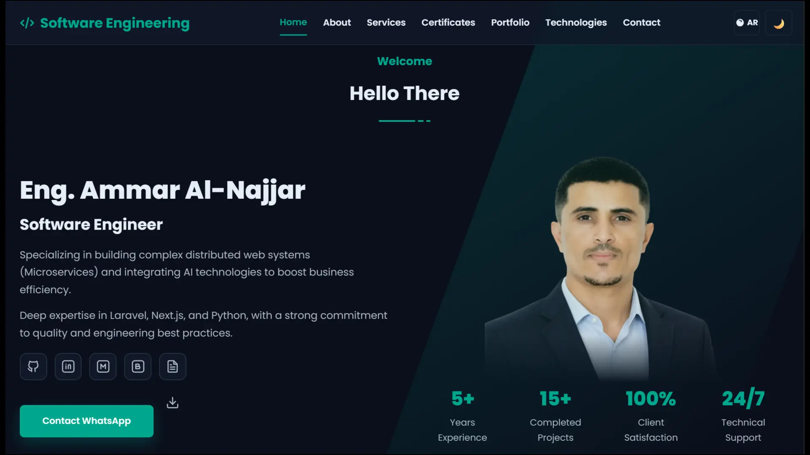
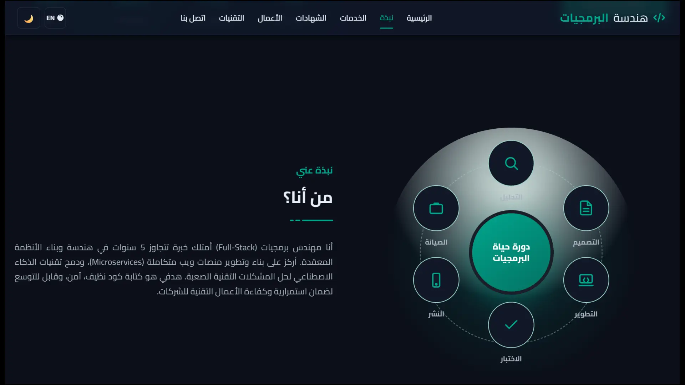
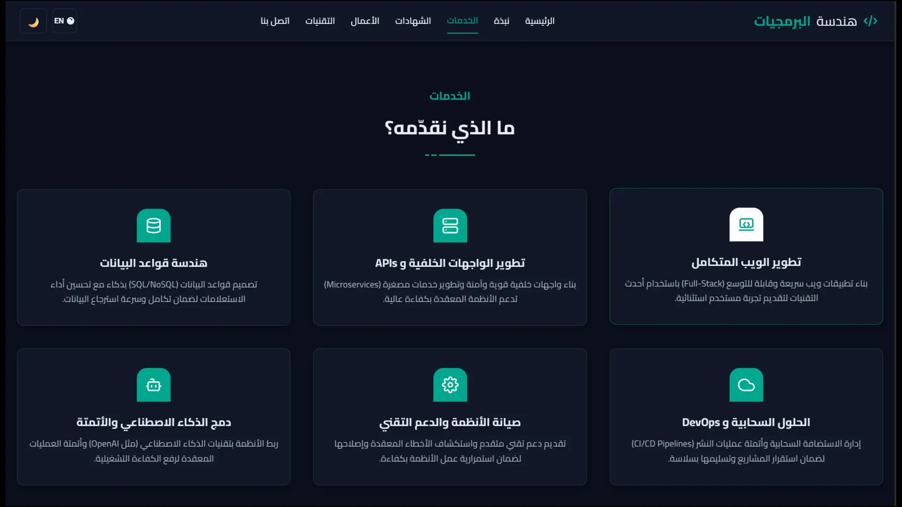
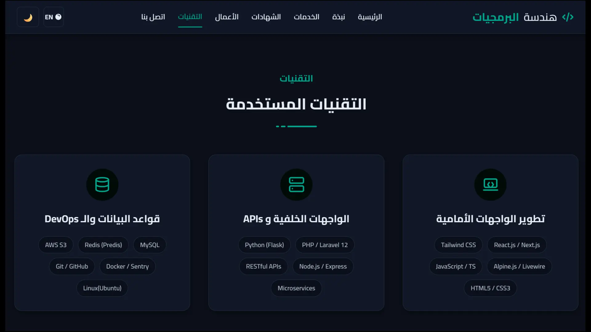
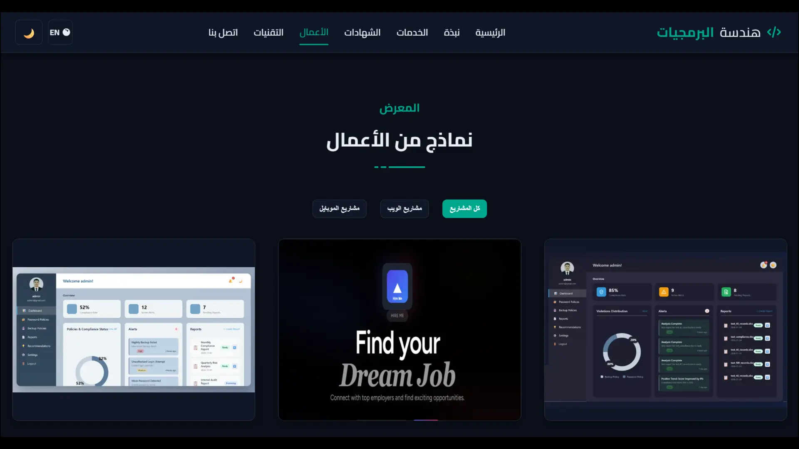
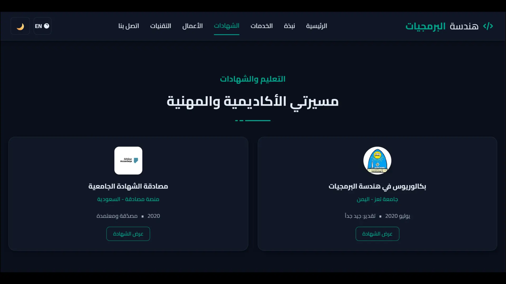
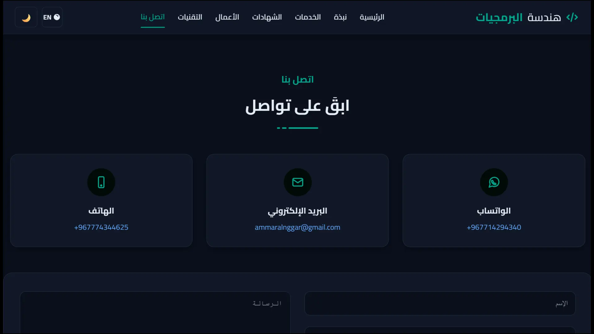

# Portfolio — Eng. Ammar Al‑Najjar

[](https://ammar1993.vercel.app/)


<div align="center">



[](https://developer.mozilla.org/en-US/docs/Web/Guide/HTML/HTML5)
[](https://developer.mozilla.org/en-US/docs/Web/CSS)
[](https://developer.mozilla.org/en-US/docs/Web/JavaScript)
[](https://getbootstrap.com)
[](https://fontawesome.com)
[](https://vercel.com/)

</div>


- [Live Site](https://ammar1993.vercel.app/)

---

## Overview
A lightweight, user-friendly, and high-performance personal website showcasing the work of engineer Ammar Al-Najjar. The site displays his services, selected projects (websites, mobile applications, and computers), the technologies used, and contact information. It features fast loading speeds, search engine optimization, a dark and light design, and supports both Arabic and English.

## Highlights
- 🎨 Dark theme with clear brand color
- 🧭 Sticky navbar + active section highlight
- 🗂️ Filterable portfolio (web/mobile/desktop) with Lightbox viewer
- 🖼️ Unified card ratio via CSS aspect-ratio
- ♿ Accessibility: semantic HTML, alt text, keyboard support, Esc to close Lightbox
- ⚡ Performance: lazy images, deferred JS, minimal scroll work
- 🌐 SEO/Social: title/description, Open Graph/Twitter cards, JSON‑LD (Person)

## Tech Stack
- **Frontend:** HTML5, CSS3 (Bootstrap RTL), Font Awesome
- **JavaScript:** Vanilla JS (no heavy libs)
- **Hosting:** Vercel


---

## Quick Start (Local)
1. **Clone:**
   ```bash
   git clone https://github.com/Ammar-1993/portfolio.git
   cd portfolio
   ```
2. Open `index.html` in your browser, or use VS Code Live Server extension.

---

## Build & Development
- **Rebuilding Portfolio Data:** Whenever you modify `data/portfolio.json`, you must run `node build.js` to regenerate the dependent HTML snippets.
- **Image Optimization:**
  - `scripts/convert-to-webp.py`: Bulk converts images to WebP format for optimal web performance.
  - `scripts/downscale-portfolio.py`: Resizes large portfolio images to uniform dimensions to save bandwidth.

---

## Deploy on Vercel
1. Push your code to GitHub.
2. Import the repository in Vercel.
3. Keep default settings (Vercel automatically detects static sites).
4. Your site will be available at:
   https://ammar1993.vercel.app/

---

## Customization
### Brand color & fonts
- Change the primary color in `style.css`:
  ```css
  :root{ --main-color:#00a78e; /* brand color */ }
  ```
- Default font: **Cairo** (adjust weights or swap as needed)

### Unified card ratio (Portfolio grid)
Set via CSS variable (default 16:9):
  ```css
  :root{
    --tile-ratio: 16/9; /* switch to 4/3 or 1/1 as you prefer */
    --tile-min-h: 220px;
  }
  .portfolio .portfolio-item-inner .portfolio-img,
  .portfolio .portfolio-item-inner-video{
    aspect-ratio: var(--tile-ratio);
    min-height: var(--tile-min-h);
    display: grid; place-items: center;
    background:#0e1626;
  }
  .portfolio .portfolio-item-inner .portfolio-img img,
  .portfolio .portfolio-item-inner-video video{
    width:100%; height:100%; object-fit: cover;
  }
  ```

### Contact links
Update WhatsApp/Mail/Tel in the **Contact** section of `index.html`.

---

## SEO (already in `index.html`)
- `<title>` and `<meta name="description">`
- Open Graph + Twitter Card (ensure `images/og-cover.jpg` exists)
- JSON‑LD Person (name/phone/email)
- `lang="ar" dir="rtl"` on `<html>`

---

## Accessibility
- Descriptive `alt` attributes for images
- Keyboard navigation (Tab, Enter/Space to open Lightbox)
- Close Lightbox via Esc
- Sufficient contrast in dark theme

---

## Performance
- Use WebP/AVIF when possible
- Add `loading="lazy"` to non-critical images
- Provide `width`/`height` to images to prevent CLS
- Keep `main.js` with `defer`

---

## Lighthouse Targets




## Screenshots

A selection of key interfaces and audits from this portfolio project. Click any thumbnail to view the full screenshot.
### Home — Hero & Intro
Primary landing section with brief bio, core CTA, and top navigation.



---

### Home (Dark) — Primary Theme
Dark-mode presentation of the hero, showing the default site theme and navigation states.


---

### Home (Dark, English) — English Layout
English-language (LTR) variant demonstrating bilingual support and layout adaptation.



---

### About Section — Profile & Summary
Personal summary, core skills, and a brief timeline / professional snapshot.



---

### Services Section
Overview of offered services with short, actionable descriptions for each service card.



---

### Technologies & Skills Section
Stack badges and proficiency highlights showing core technologies used in projects.


---

### Portfolio Gallery Section — Project Thumbnails
Grid view of selected projects with Lightbox previews and filtering controls.


---


### Certificates Section
Professional certificates and achievements highlighting skill proficiency.


---

### Contact Section
Contact methods, social links, and quick actions for hiring or inquiries.



---


### Copyright (c) 2025 Ammar Al-Najjar

Permission is hereby granted, free of charge, to any person obtaining a copy
of this software and associated documentation files (the "Software"), to deal
in the Software without restriction, including without limitation the rights
to use, copy, modify, merge, publish, distribute, sublicense, and/or sell
copies of the Software, and to permit persons to whom the Software is
furnished to do so, subject to the following conditions:

The above copyright notice and this permission notice shall be included in all
copies or substantial portions of the Software.

THE SOFTWARE IS PROVIDED "AS IS", WITHOUT WARRANTY OF ANY KIND, EXPRESS OR
IMPLIED, INCLUDING BUT NOT LIMITED TO THE WARRANTIES OF MERCHANTABILITY,
FITNESS FOR A PARTICULAR PURPOSE AND NONINFRINGEMENT. IN NO EVENT SHALL THE
AUTHORS OR COPYRIGHT HOLDERS BE LIABLE FOR ANY CLAIM, DAMAGES OR OTHER
LIABILITY, WHETHER IN AN ACTION OF CONTRACT, TORT OR OTHERWISE, ARISING FROM,
OUT OF OR IN CONNECTION WITH THE SOFTWARE OR THE USE OR OTHER DEALINGS IN THE
SOFTWARE.

---

## Contact
- Phone/WhatsApp: `+967714294340`
- Email: `ammaralnggar@gmail.com`
<!-- - Phone: `+967774344625` -->

---

<div align="center">
  <br />
  <p>Developed By ❤️ <b>Engineer Ammar Al-Najjar</b></p>
</div>


