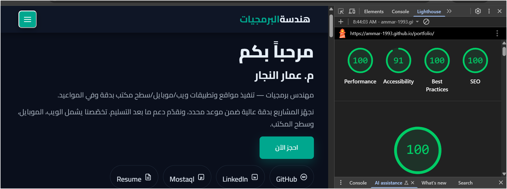

# Portfolio — Eng. Ammar Al‑Najjar

[](https://ammar-1993.github.io/portfolio/)


---

## Quick Navigation
- [Live Site](https://ammar-1993.github.io/portfolio/)
- [Repository](https://github.com/Ammar-1993/portfolio)
- [Overview](#overview)
- [Highlights](#highlights)
- [Tech Stack](#tech-stack)
- [Quick Start](#quick-start-local)
- [Deploy](#deploy-on-github-pages)
- [Customization](#customization)
- [SEO](#seo-already-in-indexhtml)
- [Accessibility](#accessibility)
- [Performance](#performance)
- [Lighthouse Targets](#lighthouse-targets)
- [License](#license)
- [Contact](#contact)

---

## Overview
Arabic (RTL) portfolio website for Ammar Al-Najjar, showcasing services, selected projects (Web / Mobile / Desktop), technology stacks, and contact options. Optimized for speed, accessibility, and SEO with a dark theme by default.

## Highlights
- 🎨 Dark theme with clear brand color
- 🧭 Sticky navbar + active section highlight
- 🗂️ Filterable portfolio (web/mobile/desktop) with Lightbox viewer
- 🖼️ Unified card ratio via CSS aspect-ratio
- 📱 PWA features: installable, offline support, update notifications
- ♿ Accessibility: semantic HTML, alt text, keyboard support, Esc to close Lightbox
- ⚡ Performance: lazy images, deferred JS, minimal scroll work
- 🌐 SEO/Social: title/description, Open Graph/Twitter cards, JSON‑LD (Person)

## Tech Stack
- **Frontend:** HTML5, CSS3 (Bootstrap RTL), Font Awesome
- **JavaScript:** ES6 Modules (no bundling required)
- **Build Tools:** Eleventy (SSG), Node.js, CleanCSS, Terser, Sharp
- **Linting:** ESLint, Stylelint
- **Deployment:** GitHub Pages (gh-pages)
- **Hosting:** GitHub Pages

## Development Setup
This project uses Eleventy (11ty) as a static site generator and ES6 modules for JavaScript.

### Prerequisites
- Node.js (v16+)
- npm

### Installation & Development
```bash
# Install dependencies
npm install

# Start development server (with live reload)
npm run serve

# Build for production (linting + image optimization + CSS/JS minification + Eleventy)
npm run build

# Run linting (ESLint + Stylelint)
npm run lint

# Fix linting issues automatically
npm run lint:fix

# Deploy to GitHub Pages
npm run deploy

# Build CSS only (with minification)
npm run build:css

# Build JS only (with minification)
npm run build:js

# Optimize images (WebP/AVIF conversion)
npm run optimize:images
```

### Project Structure
```
portfolio/
├── src/                     # Source JavaScript (ES6 modules)
│   ├── main.mjs            # Main entry point
│   └── modules/            # Modular JavaScript components
│       ├── utils.js        # Shared utilities
│       ├── theme.js        # Theme management
│       ├── navigation.js   # Navbar, scrolling, mobile menu
│       ├── skills.js       # Skills animation
│       ├── portfolio.js    # Portfolio filtering & lightbox
│       └── pwa.js          # Service worker & install button
├── css/
│   ├── partials/           # Modular CSS files
│   │   ├── _variables.css
│   │   ├── _base.css
│   │   ├── _navbar.css
│   │   ├── _home.css
│   │   ├── _about.css
│   │   ├── _services.css
│   │   ├── _portfolio.css
│   │   ├── _technologies.css
│   │   ├── _contact.css
│   │   ├── _footer.css
│   │   ├── _lightbox.css
│   │   └── _mobile.css
│   └── style.css           # Compiled & minified CSS
├── js/                     # Built JavaScript (copied from src/)
├── _data/                  # Eleventy data files
├── _layouts/               # Base layout templates
├── index.njk              # Arabic homepage template
├── index-en.njk           # English homepage template
├── build-css.js           # CSS build script
├── build-js.js            # JS minification script
├── optimize-images.js      # Image optimization script
└── .eleventy.js           # Eleventy configuration

### Build Process & Quality Assurance
The project includes a comprehensive build pipeline with linting, optimization, and deployment automation:

#### Linting & Code Quality
- **ESLint:** JavaScript linting with ES6 module support
- **Stylelint:** CSS linting with standard configuration
- **Auto-fix:** `npm run lint:fix` automatically fixes common issues

#### Asset Optimization
- **Image Optimization:** Converts PNG to WebP/AVIF formats (54.8% WebP, 35% AVIF size reduction)
- **CSS Minification:** CleanCSS with 29% compression ratio
- **JavaScript Minification:** Terser with console/debugger removal

#### Build Pipeline
```bash
npm run build  # Complete production build with all optimizations
├── npm run lint          # Code quality checks
├── npm run optimize:images  # Image format conversion
├── npm run update:version   # Automated PWA versioning
├── npm run build:css     # CSS compilation & minification
├── npm run build:js      # JS minification
└── eleventy              # Static site generation
```

#### Deployment
- **GitHub Pages:** Automated deployment with `npm run deploy`
- **GitHub Actions:** CI/CD pipeline for automatic builds on push
```

### Recent Refactoring (2024)
- ✅ **Eleventy SSG Migration:** Converted static HTML to Nunjucks templates with data-driven content
- ✅ **CSS Modularization:** Split monolithic `style.css` into 11 logical partials for better maintainability
- ✅ **JavaScript Modularization:** Refactored `main.js` into 6 ES6 modules with error handling
- ✅ **Build Process:** Automated linting (ESLint/Stylelint), image optimization (WebP/AVIF), CSS/JS minification, and deployment
- ✅ **Quality Assurance:** Code linting with auto-fix capabilities and comprehensive error checking
- ✅ **Asset Optimization:** Modern image formats (54.8% WebP savings, 35% AVIF savings) with lazy loading
- ✅ **Bilingual Support:** Centralized strings and portfolio data in JSON files
- ✅ **Performance Optimizations:** Content visibility, lazy loading, and mobile-first responsive design
- ✅ **PWA Enhancement:** Advanced service worker with multiple caching strategies, automated versioning, and update notifications

---

## Quick Start (Local)
1. **Clone:**
   ```bash
   git clone https://github.com/Ammar-1993/portfolio.git
   cd portfolio
   ```
2. Open `index.html` in your browser, or use VS Code Live Server extension.

---

## Deploy on GitHub Pages
The site uses Eleventy SSG and GitHub Actions for automated deployment.

### Automatic Deployment (Recommended)
1. **GitHub Actions Setup:** The repository includes a GitHub Actions workflow (`.github/workflows/deploy.yml`) that automatically builds and deploys on every push to `main`.
2. **Enable GitHub Pages:**
   - Go to **Settings → Pages**
   - Source: *GitHub Actions*, then Save
3. **Push Changes:** Commit and push your changes to the `main` branch. The site will be automatically built and deployed.

### Manual Deployment (Alternative)
If you prefer to build locally:
```bash
# Build the site
npm run build

# The built files will be in _site/
# Commit and push the _site folder, then configure Pages to serve from _site branch/folder
```

### Deployment Notes
- **Source files** (`.njk`, `css/partials/`, etc.) are in the repository root
- **Built files** are generated in `_site/` and served by GitHub Pages
- The `_site/` folder is ignored by `.gitignore` to avoid committing build artifacts
- GitHub Actions handles the build process automatically

Your site will be available at: https://ammar-1993.github.io/portfolio/

---

## Customization
### Brand color & fonts
- Change the primary color in `style.css`:
  ```css
  :root{ --main-color:#00a78e; /* brand color */ }
  ```
- Default font: **Cairo** (adjust weights or swap as needed)

### Unified card ratio (Portfolio grid)
Set via CSS variable (default 16:9):
  ```css
  :root{
    --tile-ratio: 16/9; /* switch to 4/3 or 1/1 as you prefer */
    --tile-min-h: 220px;
  }
  .portfolio .portfolio-item-inner .portfolio-img,
  .portfolio .portfolio-item-inner-video{
    aspect-ratio: var(--tile-ratio);
    min-height: var(--tile-min-h);
    display: grid; place-items: center;
    background:#0e1626;
  }
  .portfolio .portfolio-item-inner .portfolio-img img,
  .portfolio .portfolio-item-inner-video video{
    width:100%; height:100%; object-fit: cover;
  }
  ```

### Contact links
Update WhatsApp/Mail/Tel in the **Contact** section of `index.html`.

---

## SEO (already in `index.html`)
- `<title>` and `<meta name="description">`
- Open Graph + Twitter Card (ensure `images/og-cover.jpg` exists)
- JSON‑LD Person (name/phone/email)
- `lang="ar" dir="rtl"` on `<html>`

#### Quick checklist
- [ ] Accurate Arabic title and description
- [ ] OG image ≥ 1200×630
- [ ] Valid contact/social links

---

## Accessibility
- Descriptive `alt` attributes for images
- Keyboard navigation (Tab, Enter/Space to open Lightbox)
- Close Lightbox via Esc
- Sufficient contrast in dark theme

---

## Performance
- Use WebP/AVIF when possible
- Add `loading="lazy"` to non-critical images
- Provide `width`/`height` to images to prevent CLS
- Keep `main.js` with `defer`

---

## Lighthouse Targets
- Performance ≥ 95
- Accessibility ≥ 90
- Best Practices ≥ 95
- SEO ≥ 95

> Tip: Chrome DevTools → Lighthouse → Generate report.
> 

---

## License

Copyright (c) 2025 Ammar Al-Najjar

Permission is hereby granted, free of charge, to any person obtaining a copy
of this software and associated documentation files (the "Software"), to deal
in the Software without restriction, including without limitation the rights
to use, copy, modify, merge, publish, distribute, sublicense, and/or sell
copies of the Software, and to permit persons to whom the Software is
furnished to do so, subject to the following conditions:

The above copyright notice and this permission notice shall be included in all
copies or substantial portions of the Software.

THE SOFTWARE IS PROVIDED "AS IS", WITHOUT WARRANTY OF ANY KIND, EXPRESS OR
IMPLIED, INCLUDING BUT NOT LIMITED TO THE WARRANTIES OF MERCHANTABILITY,
FITNESS FOR A PARTICULAR PURPOSE AND NONINFRINGEMENT. IN NO EVENT SHALL THE
AUTHORS OR COPYRIGHT HOLDERS BE LIABLE FOR ANY CLAIM, DAMAGES OR OTHER
LIABILITY, WHETHER IN AN ACTION OF CONTRACT, TORT OR OTHERWISE, ARISING FROM,
OUT OF OR IN CONNECTION WITH THE SOFTWARE OR THE USE OR OTHER DEALINGS IN THE
SOFTWARE.

---


---

## Contact
- Phone/WhatsApp: `+967714294340`
- Email: `ammaralnggar@gmail.com`
<!-- - Phone: `+967774344625` -->


